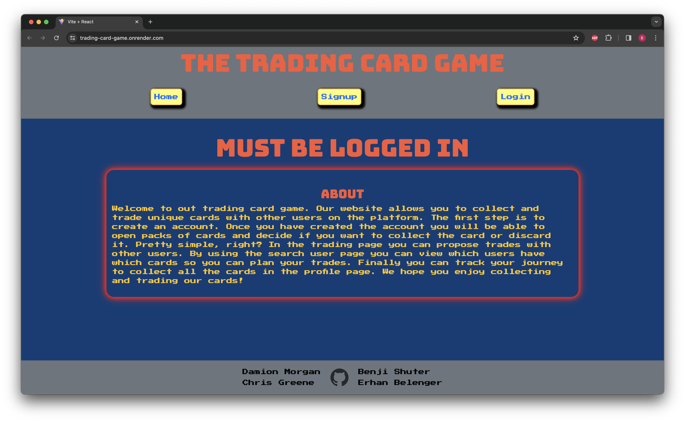
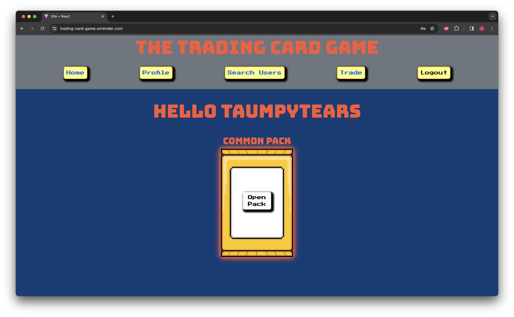
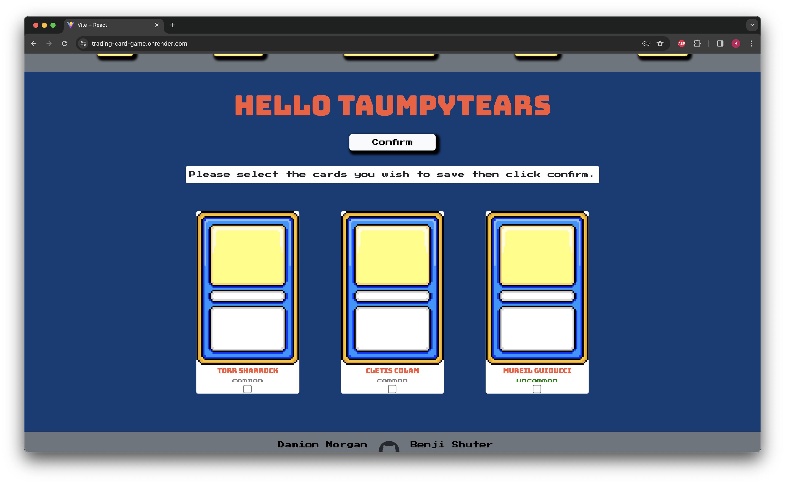
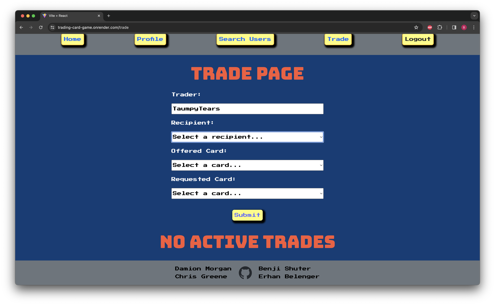
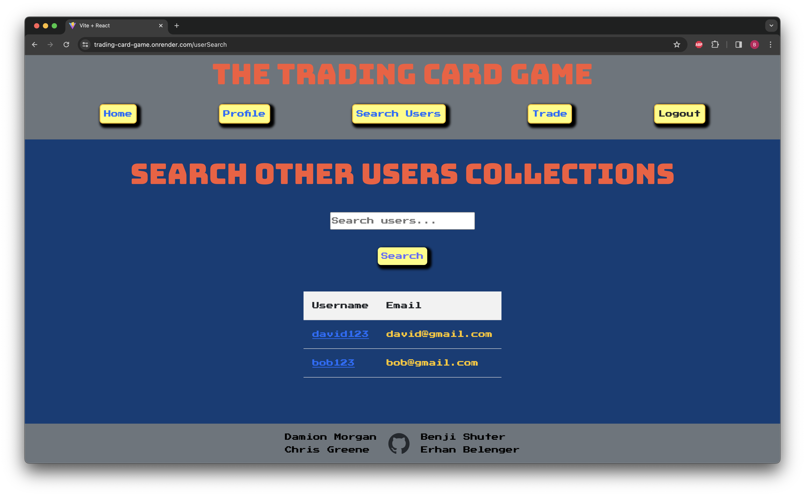

# Trading Card App

## Description
An platform that allows users to collect and trade digital cards.  Users can create accounts and begin collecting immediately.  Opening packs delivers three random cards of varying rarity.  Users can choose to save or discard the cards they receive.  A trading system allows users to find others and propose, accept, and reject trades.  A search system allows players to find others to interact and trade with.

## Roadmap
Our hope is to develop this project further, and build out features with a focus on gamefication.  Currency, inventory, and rewards systems are currently in development.

## Screenshots

## Contributors
*[Chris Green](https://github.com/chigreene)
*[Damion Morgan](https://github.com/BeginnerLevelUP)
*[Erhan Belanger](https://github.com/erhanbelanger)
*[Benjy Shuter](https://github.com/Caphtori)